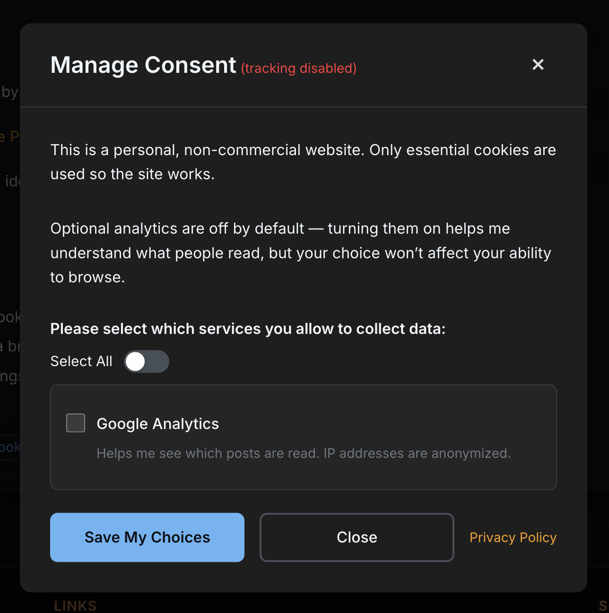
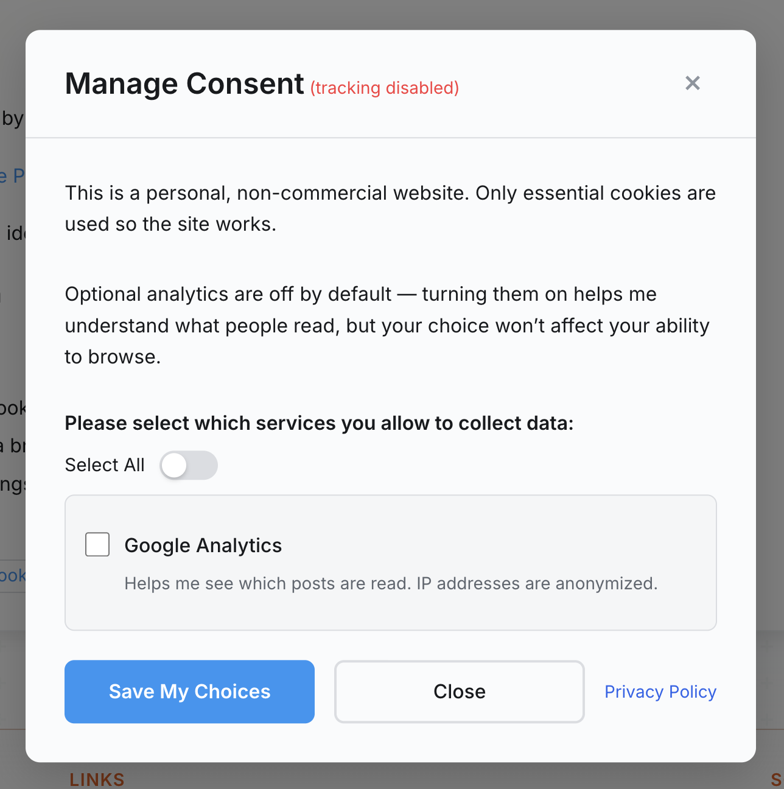
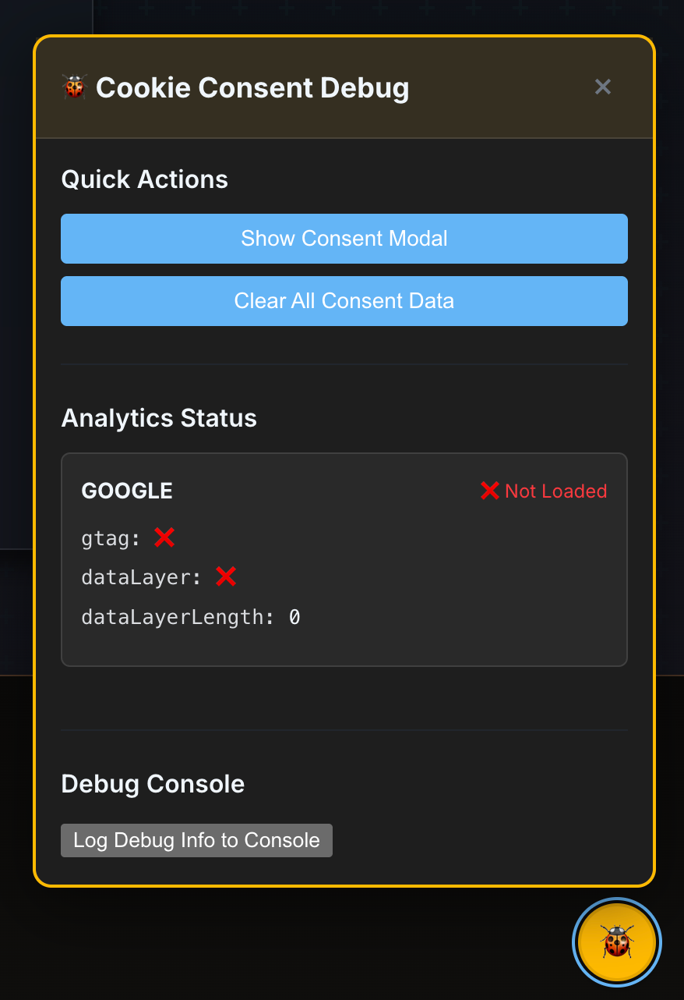

# Docusaurus Cookie Consent

[](https://www.npmjs.com/package/docusaurus-plugin-cookie-consent)
[](https://github.com/bulletinmybeard/docusaurus-plugin-cookie-consent/actions/workflows/ci.yml)
[](./LICENSE)
[](https://www.npmjs.com/package/docusaurus-plugin-cookie-consent)
[](https://bundlephobia.com/package/docusaurus-plugin-cookie-consent)
[](https://docusaurus.io/)
[](https://nodejs.org/)
[](https://reactjs.org/)
[](https://www.typescriptlang.org/)
[](https://prettier.io/)

---

GDPR-compliant cookie consent made easy for Docusaurus sites.

## Why Use This Plugin?

Building a documentation site with Docusaurus? You probably need cookie consent for analytics. This plugin is the easiest solution:

## Zero Configuration Required

- Works immediately after installation
- No theme swizzling or manual setup
- Privacy policy demo template for reference
- Smart defaults for everything

## Stay Compliant Without the Hassle

- GDPR, CCPA, and ePrivacy Directive compliant out of the box
- Auto-blocks analytics until users consent
- Remembers user preferences
- Works seamlessly with Google Analytics

## Perfect for

- Documentation sites using analytics
- Open source projects needing GDPR compliance
- Corporate documentation portals
- Any Docusaurus site collecting user data

## Common problems this solves

- "How do I add GDPR cookie consent to Docusaurus?"
- "My analytics are loading before user consent"
- "I need cookie consent in multiple languages"
- "Writing privacy policies is time-consuming"
- "Theme swizzling is too complicated"

---

## Features

### Truly Plug-and-Play

- No theme swizzling required
- Automatic component injection
- Works immediately after installation
- Client API for checking consent status

### Developer-Friendly API

- Typed client functions for consent management
- React hooks for reactive consent status
- Works with SSG and client-side rendering
- No localStorage key hardcoding needed

### Privacy Policy Demo Template

- Example privacy policy template for reference
- Shows typical privacy policy structure
- **Important**: This is only a demo - you MUST create your own custom `/privacy-policy` page tailored to your needs

### Perfect Integration

- Respects light/dark theme automatically
- Matches Docusaurus styling
- Smooth animations

### Built-in Translations

- English and German translations included
- Easy to add more languages
- Automatic locale detection

## Quick Start

### Installation

```bash
npm install docusaurus-plugin-cookie-consent
```

### Basic Setup

Add to your `docusaurus.config.js`:

```javascript
module.exports = {
  plugins: [
    'docusaurus-plugin-cookie-consent'  // That's it!
  ]
};
```

The plugin works immediately with defaults. Visitors will see a clean cookie consent modal.



### With Analytics Providers

Configure one or multiple analytics providers that will load only after user consent:

```javascript
module.exports = {
  plugins: [
    ['docusaurus-plugin-cookie-consent', {
      providers: [
        {
          type: 'google',
          id: 'G-XXXXXXXXXX',  // Your Google Analytics ID
          options: {
            anonymizeIp: true  // Optional: Additional GA configuration
          }
        }
      ]
    }]
  ]
};
```

### Multiple Analytics Providers with Granular Consent

You can use multiple analytics services simultaneously, and users can choose which ones to enable:

```javascript
module.exports = {
  plugins: [
    ['docusaurus-plugin-cookie-consent', {
      // Enable experimental features (required for Hotjar)
      enableExperimental: true,  // ⚠️ Required for experimental providers
      providers: [
        {
          type: 'google',
          id: 'G-XXXXXXXXXX',
          // Localized names and descriptions for each language
          i18n: {
            en: {
              name: 'Google Analytics',
              description: 'Helps us understand how you use our site'
            },
            de: {
              name: 'Google Analytics',
              description: 'Hilft uns zu verstehen, wie Sie unsere Seite nutzen'
            }
          },
          enabled: true,  // Optional: set to false to disable this provider
          required: false  // Optional: set to true to make non-optional
        },
        {
          type: 'gtm',
          id: 'GTM-XXXXXXX',  // Google Tag Manager Container ID
          i18n: {
            en: {
              name: 'Google Tag Manager',
              description: 'Manages our marketing and analytics tools'
            }
          }
        },
        {
          type: 'hotjar',
          id: 1234567,  // Hotjar Site ID (⚠️ Experimental - requires enableExperimental)
          i18n: {
            en: {
              name: 'Hotjar Analytics',
              description: 'Records user sessions to improve experience'
            }
          },
          options: {
            version: 6  // Optional, defaults to 6
          }
        },
        {
          type: 'custom',
          src: 'https://example.com/analytics.js',
          i18n: {
            en: {
              name: 'Custom Analytics',
              description: 'Our custom analytics solution'
            }
          },
          enabled: false,  // Example: disabled provider won't show in consent UI
          options: {
            async: true,
            defer: false
          }
        }
      ]
    }]
  ]
};
```

With granular consent, users can now:
- Choose which specific providers to enable
- See clear descriptions of what each provider does
- Accept all, decline all, or select individual providers

Analytics scripts will only load for the providers users have explicitly consented to - keeping you GDPR compliant!

### Cookie Consent UI

Modal that matches the Docusaurus theme, as light and dark themes are supported:



- **Non-intrusive**: Centered modal that doesn't block content
- **Mobile-friendly**: Responsive design for all devices
- **Accessible**: Full keyboard navigation and screen reader support
- **Theme-aware**: Automatically matches light/dark mode

### Built-in Translations

Supports multiple languages out of the box:

```javascript
// English (default)
"Manage Consent"
"This site uses cookies..."

// German (de)
"Einwilligungen verwalten"
"Diese Website verwendet Cookies..."

// Easy to add more languages
```

Currently includes English and German. Easy to add more languages!

### Analytics Integration

Works seamlessly with multiple analytics providers:

### Stable Providers
These providers are production-ready and fully supported:

- **Google Analytics** (`google`): Traditional page view and event tracking
- **Google Tag Manager** (`gtm`): Full tag management capabilities
- **Custom Scripts** (`custom`): Any third-party analytics script

### Experimental Providers
These providers require enabling experimental features:

- **Hotjar** (`hotjar`): Heatmaps, session recordings, and user feedback
  - ⚠️ Currently experimental - API may change in future versions
  - Requires `enableExperimental: true` in plugin configuration

Scripts load only after consent and are easy to configure.

### Debug Mode

The plugin includes a powerful debug mode to help you verify analytics are working correctly:

#### Enabling Debug Mode

Add `debug: true` to any provider configuration:

```javascript
providers: [
  {
    type: 'google',
    id: 'G-XXXXXXXXXX',
    debug: true  // Enable debug mode
  }
]
```

#### Debug Features

When debug mode is enabled on any provider:

1. **Floating Debug Widget** - A 🐞 button appears in the bottom-right corner
2. **Real-time Status** - See which analytics are loaded and their status
3. **Test Events** - Send test events to verify tracking
4. **Enhanced Logging** - Detailed console logs for troubleshooting



The debug panel shows:
- Provider initialization status
- DataLayer contents
- Configuration details
- Test event buttons

#### Using Debug Mode

1. Enable debug on your providers
2. Click the 🐞 button to open the debug panel
3. Check provider status (green = loaded, red = not loaded)
4. Send test events to verify tracking
5. Check your analytics dashboard for the events

### Cookie Settings Link Integration

Users can change their cookie preferences anytime by clicking a link anywhere on your site:


Add a "Cookie Settings" link anywhere (commonly in the footer):

```javascript
// In docusaurus.config.js footer configuration
footer: {
  links: [{
    items: [{
      label: 'Cookie Settings',
      href: '#',
      className: 'footer__link-item--cookie-settings'  // Default selector
    }]
  }]
}
```

#### Custom Cookie Settings Selector

You can place the cookie settings link anywhere on your site (header, sidebar, footer, etc.) and use a custom selector:

```javascript
module.exports = {
  plugins: [
    ['docusaurus-plugin-cookie-consent', {
      cookieSettingsSelector: '.my-cookie-settings-link',  // Your custom CSS selector
      // ... other options
    }]
  ]
};
```

Then use your custom class anywhere in your site:

```javascript
// In a React component
<a href="#" className="my-cookie-settings-link">
  Manage Cookie Preferences
</a>

// Or in navbar
navbar: {
  items: [{
    label: 'Cookie Settings',
    href: '#',
    className: 'my-cookie-settings-link'
  }]
}

// Or in footer
footer: {
  links: [{
    items: [{
      label: 'Privacy & Cookies',
      href: '#',
      className: 'my-cookie-settings-link'
    }]
  }]
}
```

### Smart UX Features

**Silly Decline Button** (optional): A fun feature that makes the decline button playfully dodge the cursor - encouraging users to actually read the consent text!


---

## Customization

### Change the Texts

Don't like the default wording? Customize everything:

```javascript
module.exports = {
  plugins: [
    ['docusaurus-plugin-cookie-consent', {
      i18n: {
        texts: {
          en: {
            title: 'Cookie Preferences',
            description: 'We use cookies to improve your experience.',
            acceptButton: 'Accept All',
            declineButton: 'Reject All'
          }
        }
      }
    }]
  ]
};
```

### Environment-based Configuration

You can conditionally load different analytics providers based on environment:

```javascript
const isProduction = process.env.NODE_ENV === 'production';

module.exports = {
  plugins: [
    ['docusaurus-plugin-cookie-consent', {
      providers: [
        // Always load Google Analytics
        {
          type: 'google',
          id: process.env.GA_ID || 'G-XXXXXXXXXX'
        },
        // Only load Hotjar in production
        ...(isProduction ? [{
          type: 'hotjar',
          id: parseInt(process.env.HOTJAR_ID) || 1234567
        }] : [])
      ]
    }]
  ]
};
```

### Privacy Policy Demo Template

The plugin provides a demo privacy policy template as an example:

```javascript
module.exports = {
  plugins: [
    ['docusaurus-plugin-cookie-consent', {
      // Privacy policy demo will be generated at /privacy-policy-demo
      // Create your own custom privacy policy at /privacy-policy
    }]
  ]
};
```

This creates a demo privacy policy at `/privacy-policy-demo` - this is ONLY an example template to help you understand privacy policy structure. You MUST create your own tailored privacy policy at `/privacy-policy`!

#### Using Your Own Privacy Policy

Prefer to write your own? Simply disable the auto-generated page:

```javascript
module.exports = {
  plugins: [
    ['docusaurus-plugin-cookie-consent', {
      privacyPolicy: {
        url: '/privacy-policy-demo',
        disable: true  // Disable the demo page to use your own
      }
    }]
  ]
};
```

Then create your privacy policy at `src/pages/privacy-policy.md`.

> **Note**: The plugin provides a demo privacy policy template at `/privacy-policy-demo`. This is ONLY an example to show structure. You MUST create your own privacy policy at `/privacy-policy` that's properly tailored to your website and legal requirements. To disable the demo page, set `disableDemo: true` in the plugin configuration.

---

## Common Questions

### What cookies does this plugin use?

The plugin itself only creates one cookie:

- `docusaurus_cookie_consent` - Stores the user's consent choice (365 days)

Your Docusaurus site may use other cookies:

- `theme` - Light/dark mode preference
- `docusaurus.tab.*` - Remembers selected tabs in code blocks

### How do I test different languages?

For development/testing, you can force a specific language:

```javascript
module.exports = {
  plugins: [
    ['docusaurus-plugin-cookie-consent', {
      i18n: {
        forceLocale: 'en'  // Force specific locale
      }
    }]
  ]
};
```

### Can I use this with other analytics providers?

Yes! The custom provider type supports features for any analytics service:

#### Basic Custom Script
```javascript
module.exports = {
  plugins: [
    ['docusaurus-plugin-cookie-consent', {
      providers: [
        {
          type: 'custom',
          src: 'https://analytics.example.com/script.js',
          options: {
            async: true,
            defer: false
          }
        }
      ]
    }]
  ]
};
```

#### Advanced Custom Provider Examples

##### Authenticated Analytics with Headers
```javascript
{
  type: 'custom',
  src: 'https://analytics.example.com/secure-script.js',
  loadMethod: 'fetch',  // Use fetch to include headers
  options: {
    fetchOptions: {
      headers: {
        'Authorization': 'Bearer YOUR_API_TOKEN',
        'X-Client-ID': 'docusaurus-site',
        'X-Environment': 'production'
      },
      credentials: 'include'  // Include cookies if needed
    },
    onLoad: () => {
      console.log('Authenticated analytics loaded');
    },
    onError: (error) => {
      console.error('Failed to load analytics:', error);
    }
  }
}
```

##### Third-Party Widget with Security
```javascript
{
  type: 'custom',
  src: 'https://widget.example.com/embed.js',
  options: {
    // Security attributes
    crossorigin: 'anonymous',
    integrity: 'sha384-oqVuAfXRKap7fdgcCY5uykM6+R9GqQ8K/uxy9rx7HNQlGYl1kPzQho1wx4JwY8wC',
    nonce: 'YOUR_CSP_NONCE',

    // Custom attributes
    attributes: {
      'data-widget-id': '12345',
      'data-theme': 'dark'
    },

    // Wait for widget to be ready
    waitForGlobals: ['WidgetAPI', 'WidgetAPI.ready'],

    // Initialize after loading
    initCode: () => {
      window.WidgetAPI.init({
        containerId: 'widget-container',
        apiKey: 'YOUR_WIDGET_KEY'
      });
    }
  }
}
```

##### Inline Analytics Script
```javascript
{
  type: 'custom',
  loadMethod: 'inline',
  inlineScript: `
    (function() {
      var tracker = window.tracker || [];
      tracker.push(['setAccount', 'ACCOUNT_ID']);
      tracker.push(['trackPageView']);
      window.tracker = tracker;
    })();
  `,
  options: {
    placement: 'body-end',  // Place at end of body
    onLoad: () => {
      console.log('Inline tracking code executed');
    }
  }
}
```

##### Analytics with Retry Logic
```javascript
{
  type: 'custom',
  src: 'https://cdn.analytics.com/v2/analytics.js',
  options: {
    // Retry configuration
    retry: {
      attempts: 3,      // Try 3 times
      delay: 2000,      // Wait 2 seconds between attempts
      backoff: true     // Exponential backoff (2s, 4s, 8s)
    },

    // Timeout configuration
    timeout: 10000,  // 10 second timeout

    // Lifecycle callbacks
    onBeforeLoad: async () => {
      // Prepare environment before loading
      window.analyticsConfig = {
        debug: true
      };
    },
    onLoad: () => {
      // Initialize after successful load
      window.analytics.init('YOUR_ACCOUNT_ID');
    },
    onError: (error) => {
      // Handle loading failure
      console.error('Analytics failed after retries:', error);
      // Could fall back to a different provider
    }
  }
}
```

##### Complex Multi-Step Initialization
```javascript
{
  type: 'custom',
  src: 'https://platform.example.com/sdk.js',
  options: {
    // Wait for SDK to be available
    waitForGlobals: ['PlatformSDK'],

    // Complex initialization
    initCode: async () => {
      // Step 1: Configure SDK
      await window.PlatformSDK.configure({
        apiKey: 'YOUR_API_KEY',
        environment: 'production',
        userId: getUserId()
      });

      // Step 2: Load additional modules
      await window.PlatformSDK.loadModule('analytics');
      await window.PlatformSDK.loadModule('feedback');

      // Step 3: Start tracking
      window.PlatformSDK.analytics.trackPageView();

      // Step 4: Setup event listeners
      document.addEventListener('click', (e) => {
        if (e.target.matches('[data-track]')) {
          window.PlatformSDK.analytics.track(
            e.target.dataset.track
          );
        }
      });
    },

    // Place in body for DOM access
    placement: 'body'
  }
}
```

### The modal isn't showing

Check these common issues:

1. **Clear your browser data** - You may have already consented
2. **Check localStorage** - Remove `docusaurus_cookie_consent` key
3. **Use incognito mode** - Fresh state for testing
4. **Check for errors** - Open browser console

---

## Advanced Usage

### Client API

The plugin provides a typed client API for checking consent status from anywhere in your Docusaurus site:

```javascript
import { getConsentStatus, onConsentChange } from 'docusaurus-plugin-cookie-consent/client';

// Check current consent status
const hasConsent = getConsentStatus(); // true | false | null

// Listen for consent changes
const unsubscribe = onConsentChange((accepted, consentData) => {
  console.log('Consent changed:', accepted);
  // Trigger custom analytics, update UI, etc.
});

// Clean up listener
unsubscribe();
```

### React Hooks

Use React hooks for reactive consent management:

```jsx
import { useConsentStatus, useAnalyticsReady } from 'docusaurus-plugin-cookie-consent/client/hooks';

function MyComponent() {
  const consentStatus = useConsentStatus(); // Updates in real-time
  const analyticsReady = useAnalyticsReady();

  return (
    <div>
      {consentStatus === null && <p>No consent decision yet</p>}
      {consentStatus === true && <p>Thank you for accepting cookies!</p>}
      {consentStatus === false && <p>Cookies are disabled</p>}

      {analyticsReady && <AnalyticsWidget />}
    </div>
  );
}
```

### Full API Reference

```typescript
// Core functions
import {
  getConsentStatus,    // Get current consent (true/false/null)
  getConsentData,      // Get full consent data object
  updateConsent,       // Update consent programmatically
  resetConsent,        // Show consent banner again
  onConsentChange,     // Subscribe to consent changes
  canLoadAnalytics,    // Check if analytics can load
  getCookieName,       // Get storage key name
  getConfig           // Get plugin configuration
} from 'docusaurus-plugin-cookie-consent/client';

// React hooks
import {
  useConsentStatus,     // Monitor consent status
  useConsentData,       // Monitor full consent data
  useConsentListener,   // Listen to consent changes
  useAnalyticsReady,    // Check if analytics allowed
  useHasConsentDecision // Check if decision was made
} from 'docusaurus-plugin-cookie-consent/client/hooks';
```

### Window API (Legacy)

The window API is still available for backward compatibility:

```javascript
// Re-show the consent modal
window.CookieConsent.reset();

// Check consent status
if (window.CookieConsent.getStatus()) {
  console.log('User has consented to cookies');
}

// Update consent programmatically
window.CookieConsent.updateConsent(false);
```

### Events

Listen for consent changes using native events:

```javascript
window.addEventListener('cookieConsentChanged', (e) => {
  console.log('User consent:', e.detail.accepted);
  console.log('Consent data:', e.detail.consentData);
});
```

### Practical Examples

#### Conditional Component Loading

```jsx
import { useAnalyticsReady } from 'docusaurus-plugin-cookie-consent/client/hooks';

function ContactForm() {
  const analyticsReady = useAnalyticsReady();

  return (
    <form>
      {/* Form fields */}

      {analyticsReady ? (
        <ReCaptcha /> // Only load if user consented
      ) : (
        <p>Please accept cookies to enable spam protection</p>
      )}
    </form>
  );
}
```

#### Custom Analytics Integration

```javascript
import { getConsentStatus, onConsentChange } from 'docusaurus-plugin-cookie-consent/client';

// Initialize custom analytics only with consent
if (getConsentStatus() === true) {
  initializeCustomAnalytics();
}

// React to consent changes
onConsentChange((accepted) => {
  if (accepted) {
    initializeCustomAnalytics();
  } else {
    disableCustomAnalytics();
  }
});
```

### Custom Styling

Override the default styles:

```css
/* In your custom.css */
:root {
  --cookie-consent-primary: #1890ff;
  --cookie-consent-text: #333;
}

.cookieConsentModal {
  max-width: 600px !important;
}
```

---

## Configuration Reference

Full configuration with all options:

```javascript
module.exports = {
  plugins: [
    ['docusaurus-plugin-cookie-consent', {
      // Cookie settings
      cookieConfig: {
        name: 'my_consent',          // Cookie name (default: 'docusaurus_cookie_consent')
        expiry: 180                  // Days (default: 365)
      },

      // Providers - Array of tracking/analytics providers
      providers: [
        {
          type: 'google',
          id: 'G-XXXXXXXXXX',
          name: 'Google Analytics',         // Optional: custom name
          description: 'Site analytics',    // Optional: custom description
          enabled: true,                    // Optional: enable/disable provider
          required: false,                  // Optional: make provider mandatory
          debug: false,                     // Optional: enable debug mode
          options: {
            anonymizeIp: true,
            cookieFlags: 'SameSite=None;Secure'
          }
        },
        {
          type: 'gtm',
          id: 'GTM-XXXXXXX',
          options: {
            dataLayerName: 'dataLayer'  // Optional
          }
        },
        {
          type: 'hotjar',  // ⚠️ Experimental - requires enableExperimental: true
          id: 1234567,
          options: {
            version: 6  // Optional
          }
        },
        {
          type: 'custom',
          src: 'https://example.com/analytics.js',
          options: {
            async: true,
            defer: false,
            'data-domain': 'example.com'  // Custom attributes
          }
        }
      ],

      // Privacy Policy Demo
      privacyPolicy: {
        url: '/privacy-policy-demo', // Demo page URL (default: '/privacy-policy-demo')
        disable: false,              // Set true to disable the demo page (default: false)
      },

      // UI Features
      features: {
        sillyDeclineButton: false   // Playful decline button (default: false)
      },

      // Cookie Settings Link Configuration
      cookieSettingsSelector: '.footer__link-item--cookie-settings', // CSS selector for cookie settings link (default shown)

      // Internationalization
      i18n: {
        forceLocale: 'en',          // Force specific locale (testing)
        // Custom texts (override any translation)
        texts: {
          en: {
            title: 'Cookie Settings',
            acceptButton: 'Accept All'
            // ... see full list in docs
          }
        }
      }
    }]
  ]
};
```

---

## Testing Hotjar Locally with ngrok

Hotjar requires HTTPS to function. For local development, use ngrok:

1. **Install ngrok**:
   ```bash
   npm install -g ngrok
   # or download from https://ngrok.com
   ```

2. **Start your Docusaurus dev server**:
   ```bash
   npm run start  # Usually runs on port 3000
   ```

3. **Create HTTPS tunnel with ngrok**:
   ```bash
   ngrok http 3000
   ```

4. **Use the HTTPS URL**:
   ```
   Forwarding  https://abc123.ngrok.io -> localhost:3000
   ```

5. **Visit the HTTPS URL** and accept cookies - Hotjar will now track sessions!

> **Note**: The plugin will warn you in the console if Hotjar is loaded over HTTP.

---

## Troubleshooting

### Analytics Not Tracking?

1. **Enable Debug Mode**:
   ```javascript
   providers: [{
     type: 'google',
     id: 'G-XXXXXXXXXX',
     debug: true
   }]
   ```

2. **Check the Debug Panel**:
   - Click the 🐞 button
   - Verify provider shows as "✅ Loaded"
   - Send a test event
   - Check console for detailed logs

3. **Common Issues**:
   - Clear browser cookies/cache
   - Ensure you've accepted consent
   - Check browser console for errors
   - Verify your analytics ID is correct

### Hotjar Not Working on Localhost?

Hotjar requires HTTPS. Solutions:

1. **Use ngrok** (recommended):
   ```bash
   ngrok http 3000
   ```
   Then use the HTTPS URL provided

2. **Deploy to staging** with HTTPS

3. **Check debug logs**:
   - Enable `debug: true` on Hotjar provider
   - Console will show "⚠️ Hotjar requires HTTPS"

### Google Analytics Not Showing Events?

1. **Check GA4 DebugView**:
   - Go to GA4 → Admin → DebugView
   - Events should appear in real-time

2. **Verify in Network Tab**:
   - Look for requests to `google-analytics.com/g/collect`
   - Should see 200 OK responses

3. **Cookie Issues on Localhost**:
   - Remove `cookieFlags` from options if present
   - GA4 cookies might be blocked by browser settings

---

## Tips for Beginners

### New to GDPR?

GDPR requires you to:

- Get consent before using analytics cookies
- Allow users to decline cookies
- Remember their choice
- Let them change their mind later

This plugin handles all of that automatically!

### New to Docusaurus?

1. Install Docusaurus first: `npx create-docusaurus@latest my-site classic`
2. Add this plugin to track visitor analytics compliantly
3. Deploy and you're GDPR-ready!

### Privacy Policy Tips

- The auto-generated page at `/privacy-policy-demo` is just a demo/example
- Create your own privacy policy at `/privacy-policy` tailored to your needs
- Add your company details and actual data practices
- Review with your legal team to ensure compliance
- Update it when you add new data collection methods

---

## Support & Contributing

### Need Help?

- Check the [documentation](https://github.com/bulletinmybeard/docusaurus-plugin-cookie-consent/wiki)
- [Report bugs](https://github.com/bulletinmybeard/docusaurus-plugin-cookie-consent/issues)
- [Request features](https://github.com/bulletinmybeard/docusaurus-plugin-cookie-consent/issues/new)
- [Ask questions](https://github.com/bulletinmybeard/docusaurus-plugin-cookie-consent/discussions)

### Contributing

We welcome contributions! See [CONTRIBUTING.md](CONTRIBUTING.md) for:

- Development setup
- Adding translations
- Submitting pull requests

**Not a developer?** You can still help by:

- Reporting bugs
- Suggesting features
- Improving documentation
- Adding translations

### Important Documentation

- [CONTRIBUTING.md](CONTRIBUTING.md) - Contribution guidelines and development setup
- [MAINTAINER.md](MAINTAINER.md) - Maintainer guide for releases and testing
- [FIX_DOCUMENTATION.md](FIX_DOCUMENTATION.md) - Documentation of specific fixes and solutions

### License

[MIT License](LICENSE) - Use it however you like!

---

## Links

- [GitHub Repository](https://github.com/bulletinmybeard/docusaurus-plugin-cookie-consent)
- [NPM Package](https://www.npmjs.com/package/docusaurus-plugin-cookie-consent)
- [Live Demo](https://bulletinmybeard.github.io/docusaurus-plugin-cookie-consent-demo)
- [Author: Robin Schulz](https://github.com/bulletinmybeard)
